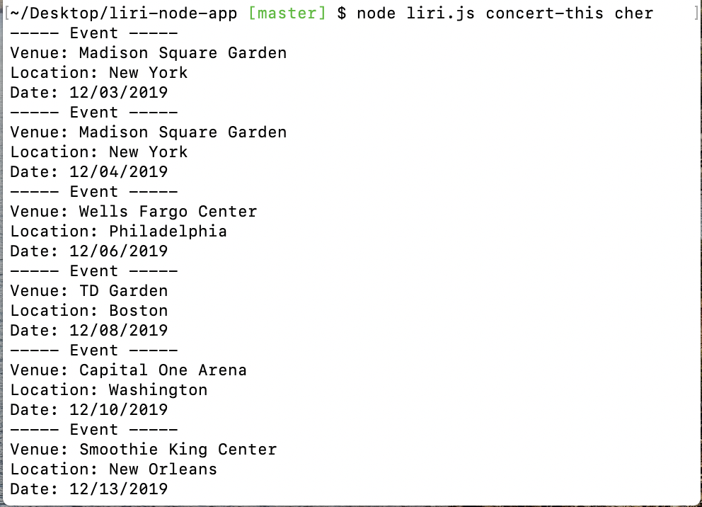
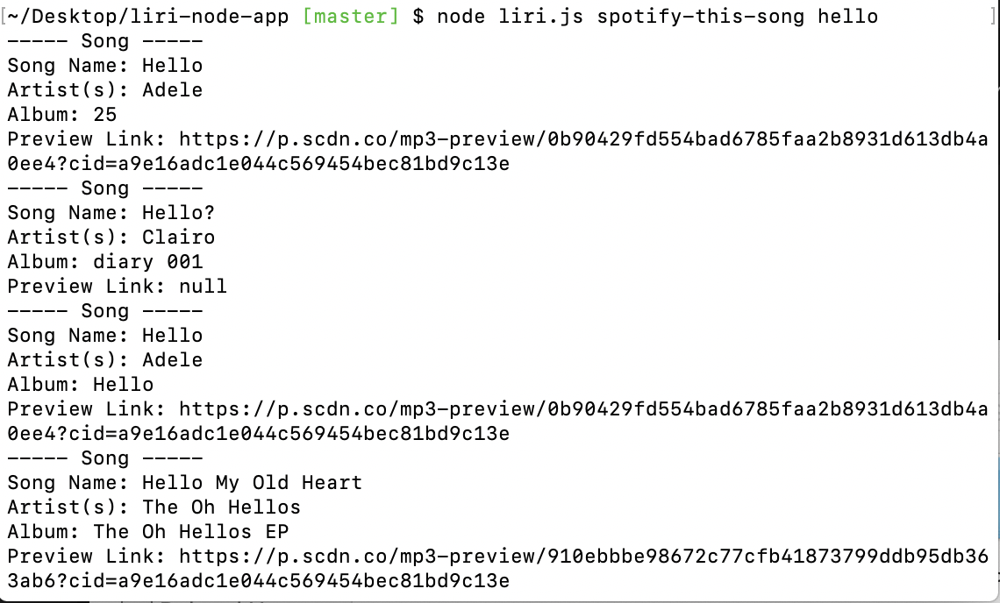
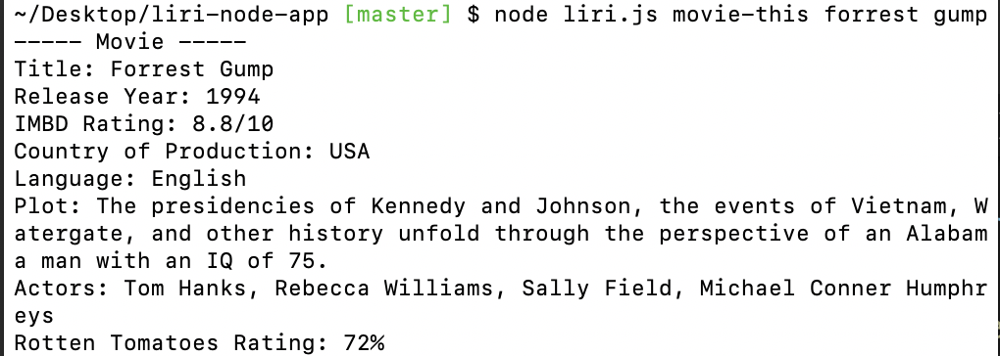
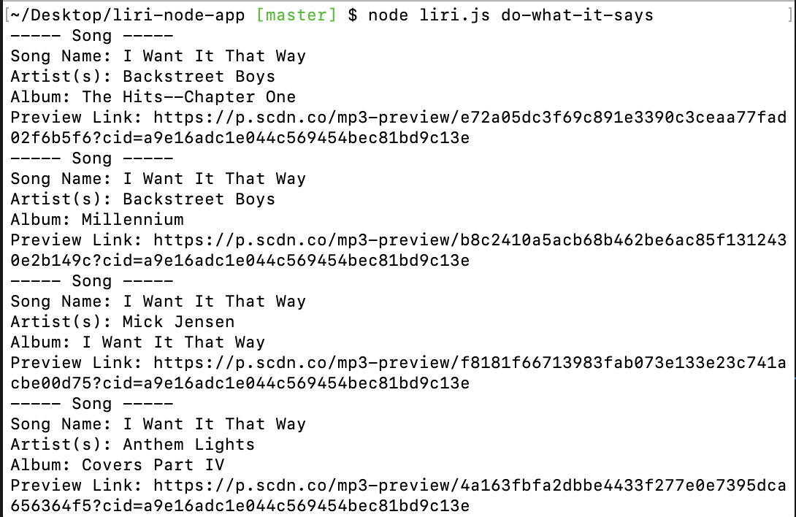

# **liri-node-app**

# ABOUT THE APP


Liri is a Language Interpretation and Recognition Interface command line node app (CLI). Liri takes in parameters and gives back data. In conjunction with the parameters, the user has four commands to chose from.
The `commands` are:

* `concert-this`
* `spotify-this-song`
* `movie-this`
* `do-what-it-says`

<hr>

# HOW TO USE LIRI

### Installations
1. Clone Github Repository 
2. Using terminal, navigate to the the liri-node-app folder
3. Create a file **.env**
4. Then create a Spotify ID using https://developer.spotify.com/dashboard/
5. Add your spotify ID to the .env file and save

    ```js
    # Spotify API keys

    SPOTIFY_ID=your-spotify-id
    SPOTIFY_SECRET=your-spotify-secret

    ```

#### **Step-by-step Instructions**

1. Open your Terminal/Gitbash
2. Navigate to the directory that containes the file liri.js
4. Run one of these commands:

    #### **Example 1:** Run the `concert-this` command

        `node liri.js concert-this <artist/band name here>`

    
   
     Output: Displays a list of upcoming events the artist/ band will perform. Including venue, location and date(MM/DD/YYYY). 
     Expect there to be one, multiple or no results at all. 


    #### **Example 2:** Run the `spotify-this-song` command

        `node liri.js spotify-this-song <song name here>`
        
    

     Output: Displays information about the song name. Expect there to be multiple results varying different artists. There is be a preview link for each associated song. 


    #### **Example 3:** Run the `movie-this` command

        `node liri.js movie-this <movie name here>`

    
     
     Output: Displays information associated with the movie name. Including title. release date,rating(s), country of production, language, plot and actors. 


    #### **Example 4:** Run the `do-what-it-says` command

        `node liri.js do-what-it-says`

    

    Output: The command do-what-it-says does not take in a parameter, instead it contains a function that reads data from a text file and displays it to the screen. The text file can be updated at anytime. 
    For this example the data used was: 

        spotify-this-song,"I Want it That Way"

---

#### LIRI BOT LIVE

<hr>

# TECHNOLOGIES USED
* Javascript
* API's a
    * OMDB
    * Bands in Town
* node.js 
* Node Package Managers (NPM)
    * axios
    * dotenv
    * file-system
    * moment
    * node-spotify-api
* Git
* Github
    
